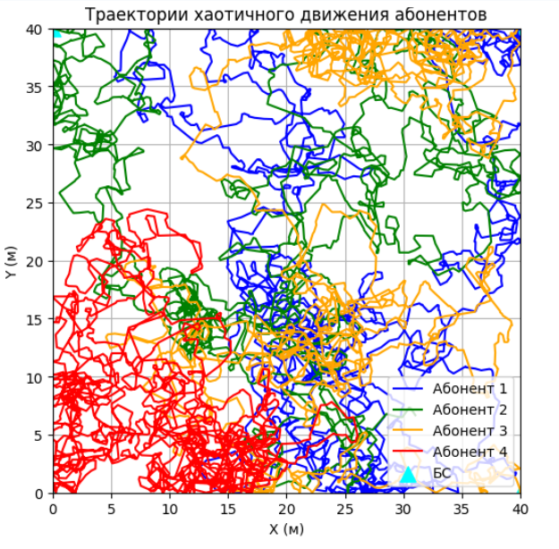

# The-problem-of-triangulating-a-transmitting-device-in-a-room-using-Wi-Fi
SUAI Dissertation

By solving the problem of triangulation of the transmitting device, one should understand the development of one's own algorithm for determining indoor positioning with the subsequent improvement of subscriber search characteristics in conditions of signal reflection.
The relevance of the work is due to the need to improve the accuracy of positioning devices indoors when using existing Wi-Fi infrastructure, as well as the need to study algorithms that are resistant to noise and instability of the radio signal.
The object of the study is the process of determining the location of a transmitting device inside a room using a wireless Wi-Fi network.
The subject of the research is algorithms for estimating subscriber coordinates based on Wi-Fi signals, mathematical modeling of the positioning process, and methods for filtering RSSI measurements.
The aim of the work is to develop and study methods for determining the coordinates of a transmitting device indoors based on Wi-Fi signals, as well as a comparative analysis of positioning algorithms in conditions of noise and dynamic movement of the subscriber.

## Trajectories

![Trajectories]

